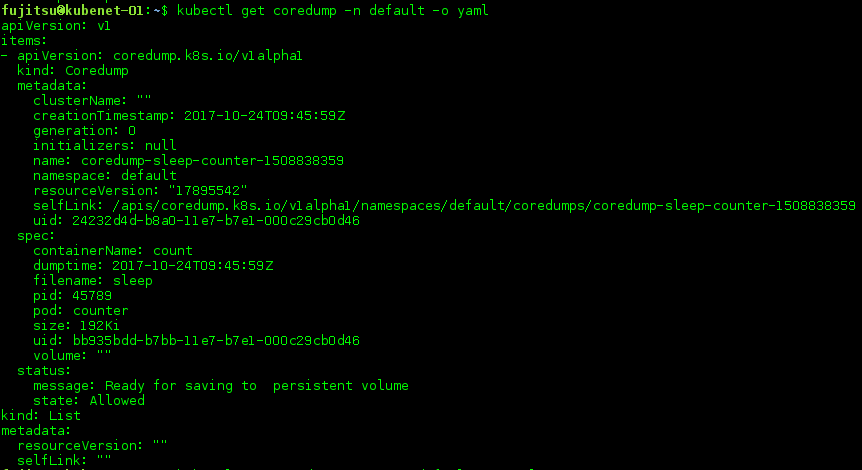
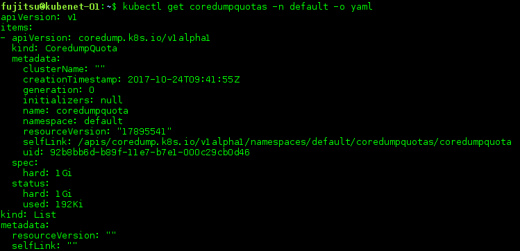
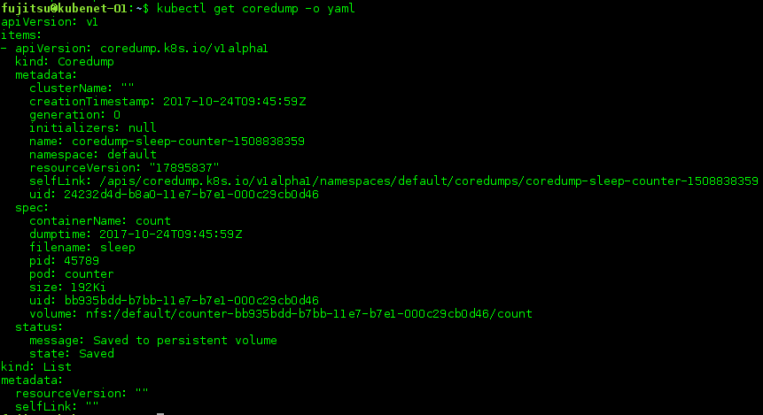

# coredump-detector

coredump-detector aims to implement coredump file isolation for each namespace.
It is a daemon which runs on each node, gathers coredump files from every pod and
save them to persistent volume in kuberenetes cluster.


# motivation and goals
Application coredump is one of required feature for enterprise systems. In Kubernetes,
we need to take "multi-tenancy" and "security" into account. Technically, under Linux,
each server’s coredump can be controlled via [/proc/sys/kernel/core_pattern](http://man7.org/linux/man-pages/man5/core.5.html)
of the host. By this, an application coredump can be passed into host’s special file or
special program. We need to build API to specify
- Where coredumps should be stored and access control to them
  - typically, namespaced persistent storage rather than host’s file system
  - access control to dumped data
  - quota for coredump for each namespace
  - no core dump label for specific environment (such as development environ)

# core_pattern
To determine whether a core file is generated for process in a k8s container, we
override /proc/sys/kernel/core_pattern kernel parameter in kubelet node.
```
|/coredump/coredump-detector -P=%P -p=%p -e=%e -t=%t -c=/coredump/config --log_dir=/coredump/
```

When coredump happens, linux kernel will call coredump-detector and give core
dump file as standard input to coredump-detector.
coredump-detector will:
* access the docker api and distinguish where(which container) the core dump comes from
* access the kubernetes cluster and distinguish which namespace this pod belongs to
* register the coredump metadata to api-server
* save core dump file to local host cache

# custom resource definition
CustomResourceDefinition (CRD) is a built-in API of kubernetes that offers a simple way
to create custom resources. We created [two CRDs](yaml/coredump-crd.yaml) to save our own
custom resource into the key-value storage, `coredumps` and `coredumpquotas`.
`coredumps` stores the metadata of coredump files:
```go
type Coredump struct {
        metav1.TypeMeta   `json:",inline"`
        metav1.ObjectMeta `json:"metadata"`
        Spec              CoredumpSpec   `json:"spec"`
        Status            CoredumpStatus `json:"status,omitempty"`
}

type CoredumpSpec struct {
        ContainerName string    `json:"containerName"`
        Pod           string    `json:"pod"`
        Uid           types.UID `json:"uid"`
        Pid           int       `json:"pid"`
        Filename      string    `json:"filename"`
        // Time is the kernel time when coredump happens.
        Time metav1.Time `json:"dumptime"`
        // Volume is the persistent volume, where coredump file is saved.
        Volume string `json:"volume"`
        // Size of coredump file
        Size *resource.Quantity `json:"size"`
}

type CoredumpStatus struct {
        State   CoredumpState `json:"state,omitempty"`
        Message string        `json:"message,omitempty"`
}
```

`coredumpquotas` defines the quota of coredump in each namespace:
```go
type CoredumpQuota struct {
        metav1.TypeMeta   `json:",inline"`
        metav1.ObjectMeta `json:"metadata"`
        Spec              QuotaSpec   `json:"spec"`
        Status            QuotaStatus `json:"status"`
}

type QuotaSpec struct {
        Hard *resource.Quantity `json:"hard"`
}

type QuotaStatus struct {
        Used *resource.Quantity `json:"used"`
        Hard *resource.Quantity `json:"hard"`
}
```

# coredump-controller
Now CRD in kubernetes doesn't support quota, so we deploy a controller who work as
quota admission controller. When a new coredump is registered in the apiserver,
coredump-controller will check the size of coredump. If total size of coredumps
exceeds the quota, the coredump file will not be saved to persistent volume.

# daemonset
daemonset runs in each kubelet node. It mounts a kubernetes persistent volume and
moves core dump file to the volume. If coredump-controller mark a coredump as `Allowed`
in apiserver,daemonset will save the coredump file into the persistent volume. 
Currently, all coredump files are save in the same persistent volume, and cluster
administrator will use extra tools to implement tenancy isolation. For example, nfs
access control, or publishing core dump files by a web application.

# usage
## build image
Run `make` in the top directory. It will:
* Build the binary.
* Build the docker image.

Then you may push the image to your own registry according to this doc:
https://docs.docker.com/engine/reference/commandline/push/

## deploy into the cluster
Before start the daemonset, users should meet the following two requriements:
* support [service account](https://kubernetes.io/docs/tasks/configure-pod-container/configure-service-account/) in cluster.
Coredump-detector uses service account to authenticate to kube-apiserver.
* a persistent volume claim named "nfs". It's easy to change this name
by modify file yaml/coredump-detector-daemonset.yaml. Core dump files
are saved in persistent volume, so a pvc is required.
* Options of kube-apiserver `--allow-privileged` should be set to true.

It's very easy to start the daemonset by creating those objects in cluster:
``` bash
kubectl create -f yaml/coredump-crd.yaml 
# setting quota is optional, if no quota is set for a namespace, it means unlimited.
kubectl create -f yaml/coredump-quota.yaml 
kubectl create -f yaml/coredump-detector-rbac.yaml
kubectl create -f yaml/coredump-controller-deployment.yaml
kubectl create -f yaml/coredump-detector-daemonset.yaml
```

## check the deployment
1. generate a coredump file in any pod. Then we can get the metadata of coredump:


2. check the quota usage, if quota is set in this namespace


3. check where the coredump file is saved, after a while:

